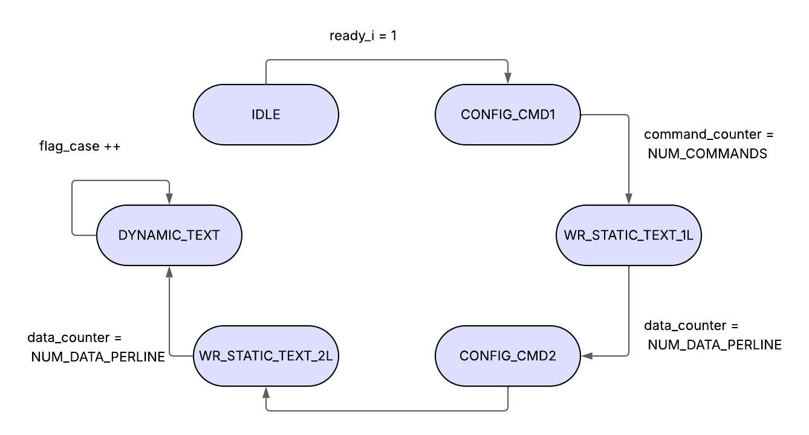

# Proyecto Final Electrónica Digital I SmartCount

# Integrantes

# Informe

Indice:

1. [Diseño implementado](#diseño-implementado)
2. [Simulaciones](#simulaciones)
3. [Implementación](#implementación)
4. [Conclusiones](#conclusiones)
5. [Referencias](#referencias)

## Diseño implementado
El diseño implementado en este proyecto se basa en una banda transportadora sobre la cual se desplazan cubos que deben ser contados automáticamente. Para ello, se utiliza un sensor de ultrasonido que detecta la presencia de cada cubo al pasar por un punto específico de la banda. La señal generada por el sensor es procesada por una FPGA, que cumple la función de unidad de control central del sistema. La FPGA interpreta las señales, incrementa un contador y actualiza en tiempo real la cantidad de cubos detectados en una pantalla LCD. Esta integración permite una supervisión clara y precisa del proceso, asegurando la confiabilidad del sistema incluso a velocidades de transporte variables.

La elección de una FPGA como núcleo del sistema responde a la necesidad de contar con una plataforma flexible, reconfigurable y capaz de ejecutar múltiples tareas en paralelo, como la lectura del sensor, el procesamiento del conteo y el control de la visualización. El diseño modular implementado permite una fácil adaptación a otras aplicaciones similares en el ámbito industrial, donde se requiere automatizar procesos de conteo o clasificación. Además, la sincronización precisa entre los componentes garantiza un funcionamiento coordinado y eficiente. 

### Descripción
A continuación se presenta la descripción de cada módulo que compone el proyecto para cada uno de los elementos que lo componen:
#### Sensor de ultrasonido
- controlador_ultrasonido:
- controlador_ultrasonido.bak:

#### Pantalla LCD
- LCD1602_controller:
  
Este módulo implementa un controlador para una pantalla LCD tipo 1602, permitiendo mostrar tanto texto estático como datos numéricos dinámicos. El controlador se basa en una máquina de estados finitos (FSM) que gestiona de forma secuencial la inicialización de la pantalla, la escritura de mensajes predefinidos en ambas líneas y la actualización periódica del contenido dinámico, como la cantidad de objetos contados. El texto estático se almacena en una memoria cargada desde archivo, mientras que los valores dinámicos se reciben como entrada (in) y se descomponen en centenas, decenas y unidades para su visualización en formato ASCII.

Para cumplir con los tiempos requeridos por la pantalla, el módulo emplea un divisor de frecuencia que genera pulsos cada 16 ms. A cada transición del pulso, se avanza en la FSM para enviar comandos o datos según el estado actual. La lógica de escritura dinámica permite mostrar números de hasta tres dígitos, usando una pequeña máquina de estados dentro del estado DYNAMIC_TEXT. Este diseño modular y parametrizable no solo cumple con los requerimientos de interfaz, sino que también permite adaptarse fácilmente a otros sistemas embebidos basados en FPGA que requieran salida visual clara y actualizable.

* Descripción de cada estado:
- IDLE:	Espera la señal ready_i. Se resetean los contadores.
- CONFIG_CMD1: Se envían comandos de inicialización desde config_mem.
- WR_STATIC_TEXT_1L: 	Se escribe la primera línea del mensaje estático desde static_data_mem.
- CONFIG_CMD2:	Se envía el comando para pasar a la segunda línea (START_2LINE).
- WR_STATIC_TEXT_2L:	Se escribe la segunda línea del mensaje estático.
- DYNAMIC_TEXT:	Se actualizan los tres dígitos del valor de entrada in (centena, decena, unidad), mostrando el número en ASCII. Avanza con flag_case.

#### Puente H

## Simulaciones 

<!-- (Incluir las de Digital si hicieron uso de esta herramienta, pero también deben incluir simulaciones realizadas usando un simulador HDL como por ejemplo Icarus Verilog + GTKwave) -->

## Implementación

El proyecto se enfocó en el desarrollo de un sistema automatizado, basado en FPGA, para el conteo de cubos que se desplazaban sobre una banda transportadora. Para detectar cada elemento, se utilizó un sensor ultrasónico cuya señal fue procesada por la FPGA. Esta actuó como unidad de control, incrementando un contador y mostrando en una pantalla LCD el número total de cubos detectados en tiempo real. El diseño permitió mantener un funcionamiento confiable incluso cuando la velocidad de transporte variaba, y su estructura modular ofrece la posibilidad de adaptarlo fácilmente a otras aplicaciones industriales que requieran tareas similares de conteo o clasificación.

Se optó por emplear una FPGA debido a su capacidad de ejecutar varias operaciones en paralelo, lo que facilitó la integración de la lectura del sensor, el procesamiento del conteo y el control de la visualización. Esta característica, sumada a su flexibilidad y posibilidad de reconfiguración, hizo que el sistema resultara eficiente y escalable.

Como complemento, se implementó un circuito antirrebote destinado a mejorar la estabilidad de la señal proveniente del pin \texttt{echo} del sensor HC-SR04. Gracias a este filtrado, se evitaron lecturas falsas ocasionadas por fluctuaciones o interferencias, lo que contribuyó a aumentar la precisión y la confiabilidad de las mediciones obtenidas.

 
## Anexos

## Conclusiones
  - El proyecto permitió aplicar el concepto de máquinas de estados finitos en un caso real de automatización, reforzando nuestra comprensión de este modelo computacional y su implementación en hardware programable.
    
 - La implementación del sensor TCS34725 con el protocolo I2C en la FPGA presentó desafíos inesperados, principalmente por la inestabilidad en la comunicación y desconocimiento del manejo del mismo. Aunque se resolvió posteriormente con un sensor infrarojo, evidenció que protocolos "sencillos" como I2C requieren diseño cuidadoso . Este problema retrasó el desarrollo, pero dejó lecciones valiosas para futuras integraciones de sensores.

  - Este proyecto demostró que se pueden crear sistemas de automatización accesibles para pequeñas empresas usando FPGAs, tal como planeamos al principio. Aunque tuvimos problemas para conectar algunos componentes, el sistema aunque no funciona en su totalidad, cumple con lo propuesto. Lo más valioso fue aprender resolviendo desafíos reales, que es justo lo que buscábamos con este trabajo.

## Referencias
